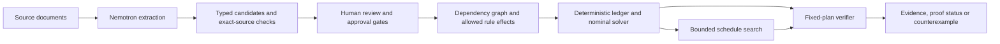

# ClauseGraph Verify

**From financial fine print to an evidence-backed plan you can test before acting.**

ClauseGraph connects the clause in a bill or agreement to the permission it grants, the actions it enables, and the cash consequences that follow. It then asks: **does this exact plan still work if payday moves or an approval changes?**

AI reads the documents. Deterministic code computes every cent. Bounded verification checks the saved schedule and shows a concrete failure when one exists. Nothing sends a payment, cancels a service, applies for a benefit, or messages a third party.

[Judge demo guide](frontend/demo/presenter-cues.md) · [Run locally](#run-locally) · [Architecture](docs/ARCHITECTURE.md) · [Synthetic fallback](frontend/demo/fallback-runbook.md)

## Why this matters

A cash crisis can be a timing problem: a bill falls due before a paycheck arrives. Moving an already-approved payment may bridge the gap. An apparently helpful cancellation can make things worse if another contract accelerates existing debt.

ClauseGraph makes those interactions inspectable:

**Source clause → reviewed rule → dependency → permitted action → deterministic cash consequence → bounded verification**

Every recommendation can be traced to its source. Evidence support, model confidence, human review, unresolved conditions and third-party approval stay separate. An unapproved benefit never silently becomes spendable cash.

## A three-minute path for judges

Start with the clearly labelled **original synthetic example**. Its six source documents and financial details are fictional; the demo needs no API keys or model calls. This is a proposed presenter script, not a measured human rehearsal.

| Step | Try it | What to look for |
|---|---|---|
| 1. Inspect the source | **View evidence** on **Move the $450 installment** | The exact clause, source version, human review and recorded approval. |
| 2. Explain the plan | **Why this plan?** | The same $450 installment moves from September 13 to September 26. Minimum cash improves from **−$400 to $50**; ending cash stays **$500**. Timing relief is not savings. |
| 3. Try to break it | **Payday through Sep 28 → Verify fixed plan** | **UNSAFE**, with all **8/8** declared dates checked. A September 27 payday produces a **−$400** balance on September 26. The saved schedule is held fixed. |
| 4. Explain the cash gap | **Explain cash gap** | **$400** is the proven minimum additional opening cash for that fixed schedule and those bounds; one cent less fails. It is hypothetical cash, **not funding**. |
| 5. Search for a resilient alternative | **Find verified alternative** | The original example reports **No solution in this declared domain**. Then explicitly **Open resilient example**, select **Payday Sep 3–5**, verify, and search again: the separate three-document fixture yields a permitted option with a **$1 fee**, **$49** minimum and **SAFE 3/3**. Adoption is a separate choice. |
| 6. Reveal a hidden consequence | Return to **Open original example**, then **Compare option alone** on **Cancel phone service** | The walkthrough links source → rule → dependency → effect → cash. Removing a **$60** charge accelerates the **same $480** device debt, giving **−$820** minimum / **$80** ending cash. The recorded plan remains unchanged. |

The comparison panel appears above the cash chart. Previews do not change the recorded plan until you explicitly apply them.

The resilient example is a **different fictional problem**, not a narrowed version of the failed original. The search returns a verified feasible fixed schedule; it does not claim the best schedule or the lowest fee. See the [full presenter cues](frontend/demo/presenter-cues.md) and [resilient example](frontend/demo/resilient-plan-demo.md).

## Three different questions, three different operations

| Operation | Question answered | Result and limits |
|---|---|---|
| Nominal planning | Which permitted actions work under the saved assumptions? | OR-Tools CP-SAT computes a schedule and reports solver/optimality status. A nominal optimum is not a robustness guarantee. |
| Fixed-plan verification | Does this saved schedule pass every case in the declared bounds? | **SAFE** requires complete coverage and resolved gates. A concrete violation proves **UNSAFE**. Otherwise, incomplete checks return **UNKNOWN**. No reoptimization occurs inside a case. |
| Resilient schedule search | Is there one permitted fixed schedule that survives the same declared bounds? | A bounded search checks candidate schedules and independently verifies a candidate before offering it. **NO_SOLUTION** requires exhausted admissible search; a cutoff is inconclusive. Explicit adoption revalidates and saves the plan and proof together. |

Verification supports up to eight income-date, integer-cent income-amount and approval-outcome dimensions, with at most 10,000 cases and a 10-second request budget. The interface reports coverage, runtime and proof limits. Guarantees apply to daily closing balances and other checked properties **within the displayed model and horizon**; they do not cover unknown real-world facts, intraday settlement, arbitrary correlations or adaptive future decisions.

The cash-gap diagnostic changes only hypothetical opening cash while holding the schedule fixed. Money cannot repair missing evidence, denied authorization or invalid accounting. Future obligations remain visible beyond the displayed horizon.

## How it works



- **Frontend:** Next.js, TypeScript, React Flow for dependencies, and Recharts for cash projections.
- **Backend:** Python, FastAPI and canonical Pydantic/OpenAPI contracts, with generated frontend types.
- **Financial engine:** integer USD cents, explicit ISO dates and an allowlisted rule language. Source text and generated content are never executed as code.
- **Planning and verification:** OR-Tools CP-SAT for nominal optimization; deterministic exhaustive bounded checking for fixed schedules; a separate bounded synthesis workflow.
- **Storage:** SQLite and private local files for the local demo; PostgreSQL support, migrations and private object-storage adapters for deployment. Sessions isolate documents, plan history and verification history.

### Where NVIDIA Nemotron is used

| Role | Configured default |
|---|---|
| Clause/entity/action extraction and request drafting | `nvidia/nemotron-3.5-lightning-30b-a3b` |
| Evidence checks and scanned-page transcription | `nvidia/nemotron-3-nano-omni-30b-a3b-reasoning` |

These are backend defaults; model IDs and endpoints are configurable. Hosted NVIDIA uses `NVIDIA_API_KEY`. Optional private Brev text inference is available through an SSH tunnel. Optional Gemini evidence/OCR and ElevenLabs audio adapters are also implemented; neither is required for the synthetic demo.

External document processing requires explicit consent for the configured destination. Credentials stay server-side. A second model's agreement never replaces exact-source validation or human review. Provider failures remain visible and never silently substitute synthetic fixtures.

**Validation boundary:** the synthetic story proves deterministic application behavior, not model accuracy. A small historical Brev native-text evaluation is recorded separately; successful hosted extraction/OCR and a complete live upload-to-review flow are not established by the synthetic tests. See the [provider evidence record](docs/SPONSORS.md), [hosted failure record](docs/handoffs/dev-a/incomplete-source-guard.md), and [NVIDIA/Brev setup](docs/NVIDIA_BREV.md).

## Run locally

Requires **Python 3.12**, **Node.js 22.23.2** and **npm 10.9.8**. Use the repository's `.nvmrc` with your Node version manager.

From the repository root on Windows PowerShell:

```powershell
python -m venv .venv
.\.venv\Scripts\python.exe -m pip install -r backend/requirements.txt -c backend/requirements.lock
npm --prefix frontend ci
if (-not (Test-Path .env)) { Copy-Item .env.example .env }
.\.venv\Scripts\python.exe scripts/dev.py
```

On macOS/Linux:

```bash
python3.12 -m venv .venv
.venv/bin/python -m pip install -r backend/requirements.txt -c backend/requirements.lock
npm --prefix frontend ci
test -f .env || cp .env.example .env
.venv/bin/python scripts/dev.py
```

Open [localhost:3000](http://localhost:3000). The launcher starts the API, worker and frontend. **Restart those processes after updating the checkout** so the running API and page use the same version. Keep existing `.env` settings and private session tokens; the setup commands do not overwrite them.

The synthetic demo runs without credentials. The worker is required for uploaded-document processing. For PostgreSQL/Compose and cloud configuration, see [deployment instructions](docs/DEPLOYMENT.md). Cloud adapters and templates alone do not establish a tested production deployment.

### Reproduce the proof without the browser

Using the activated Python environment:

```bash
python scripts/verify_demo.py
python scripts/synthesize_demo.py
python scripts/eval_nemotron.py
```

The first script reproduces the original eight-date failure, no-safe-schedule certificate and $400 hypothetical-cash result. The second checks the separate resilient example. The third tests five synthetic semantic-gate cases, including deliberately incorrect candidates; it is not a live model-accuracy benchmark. None makes an external provider call in its default mode.

## Validation you can inspect

The [merged-main CI run for `9cbe749`](https://github.com/oliverchennn/clausegraph/actions/runs/35520190296) passed **483 backend tests** including PostgreSQL and **66 browser tests**, plus Ruff, generated-contract drift checks, frontend typecheck/lint/build and clean installs on Linux, Windows and macOS. These are results for that exact checkpoint, not a live-provider or human-presentation claim.

To run the checks yourself with the Python environment activated:

```bash
python -m pytest backend/tests -q
python -m ruff check backend scripts
python scripts/export_openapi.py
npm --prefix frontend run generate:types
npm --prefix frontend run typecheck
npm --prefix frontend run lint
npm --prefix frontend run build
cd frontend
npx playwright install chromium
npm run test:e2e
```

CI supplies PostgreSQL 17; local database variants need an isolated `POSTGRES_TEST_URL`. Browser tests start their own API/frontend, so use a separate checkout when your development server is running. The [fallback runbook](frontend/demo/fallback-runbook.md) and [rehearsal log](frontend/demo/rehearsal-log.md) distinguish automated functional checks from human spoken rehearsal.

## Explore the implementation

| Start here | What it covers |
|---|---|
| [Architecture](docs/ARCHITECTURE.md) | Evidence compilation, graph, deterministic ledger and APIs |
| [Verification contract](docs/UNCERTAINTY_CONTRACT.md) | Supported dimensions, coverage and proof semantics |
| [Resilient-plan design](docs/RESILIENT_PLAN_SPEC.md) | Separate synthesis domain, budgets and adoption |
| [Consequence mapping](docs/CONSEQUENCE_WALKTHROUGH.md) | Source, rule, action and cash provenance |
| [Provider status](docs/SPONSORS.md) | Implemented integrations versus recorded live evidence |
| [Contributor contract](AGENTS.md) and [work board](docs/WORKSTREAMS.md) | Ownership, isolated tasks, review and checks |

ClauseGraph is a hackathon prototype for planning support. It uses private anonymous bearer sessions with deletion controls; account recovery and production operational controls remain future work. Users retain control over every real-world action.
